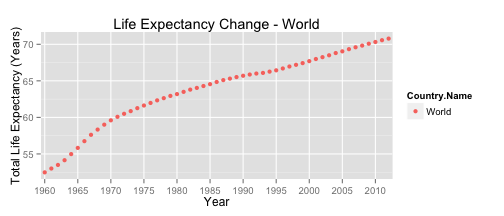

<style>
.title-slide {
  background-color: red;
}

.title-slide hgroup > h1, 
.title-slide hgroup > h2 {
  color: white;
}

.title-slide hgroup p {
color: white;
}
</style>

## World Health Monitor


Attribution: [Wikimedia Creative Commons](http://upload.wikimedia.org/wikipedia/commons/8/8d/Health_pictogram.svg)

### Goal

To provide a simple tool for visualising the World Bank data on life expectancy, and in the future to expand to other areas.

--- &radio

## Life Expectancy

What is the global life expectancy in 2010?

1. 60
2. 90
3. 85
4. _70_

*** .hint

It's less than the highest answer, and greater than the lowest answer.


*** .explanation

Well done!  70 is a little on the low side - let's monitor our situation.  If only we had a way to do that in an easy to read way...!


--- .class #id

## How we plot our fate


```r
library(shiny); library(ggplot2); library(lubridate); library(dplyr); library(reshape2)

wbd <- read.csv("worldbank/8_Topic_en_csv_v2.csv", skip = 2, na.strings = c("", " "))
fleb <- wbd[wbd$Indicator.Code == "SP.DYN.LE00.IN",]

cols <- names(fleb)
excludeIndex <- cols %in% c("X2013", "X2014", "X")
leb <- fleb[,!excludeIndex]; leb <- leb[complete.cases(leb),]
leb <- melt(leb); leb <- mutate(leb, year = gsub("X", "", variable))
leb <- leb[leb$Country.Name == "World", ]

yearLabs <- seq(1960, 2012, by = 5) 
```

--- plot #simple-plot

## Visualise it


```r
ggplot(leb, aes(x = year, y = value, color = Country.Name)) + geom_point() + 
  labs(list(x= "Year", y= "Total Life Expectancy (Years)", 
            title = "Life Expectancy Change - World")) +
  scale_x_discrete(breaks = yearLabs, labels = as.character(yearLabs))
```

 

See more at [World Health Monitor](https://rossjhagan.shinyapps.io/data-products-proj)
